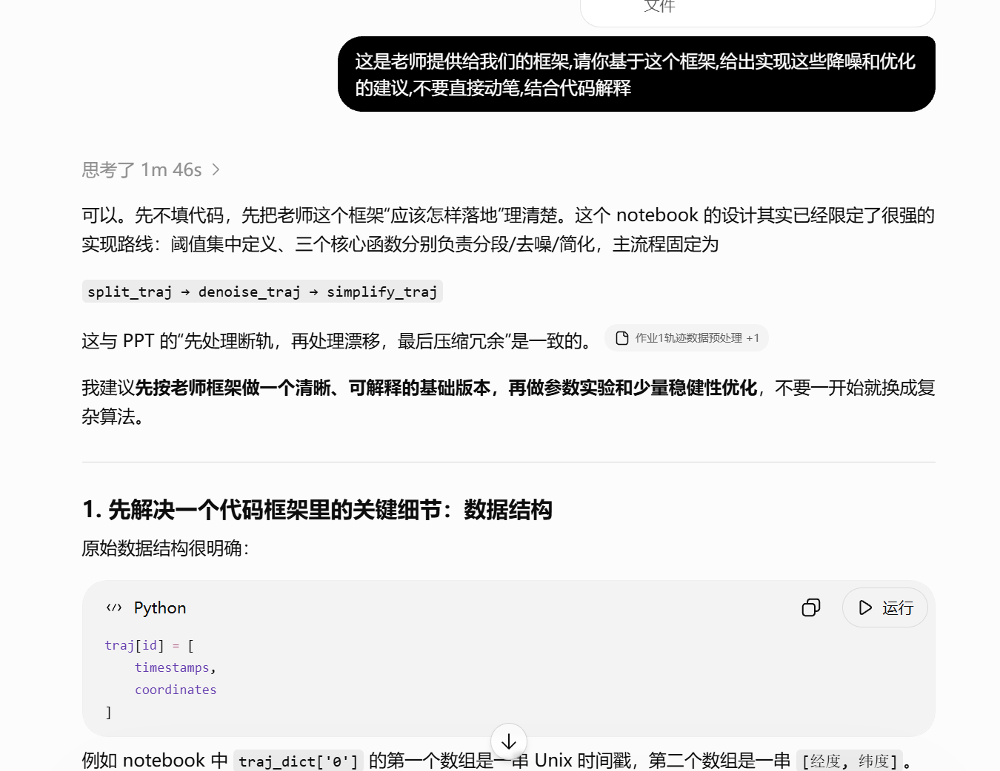
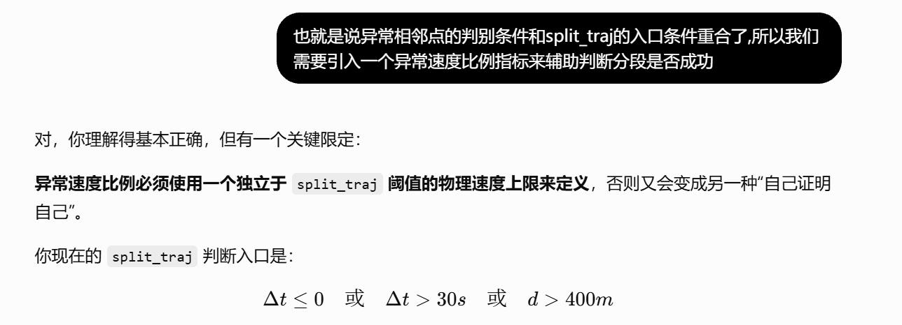
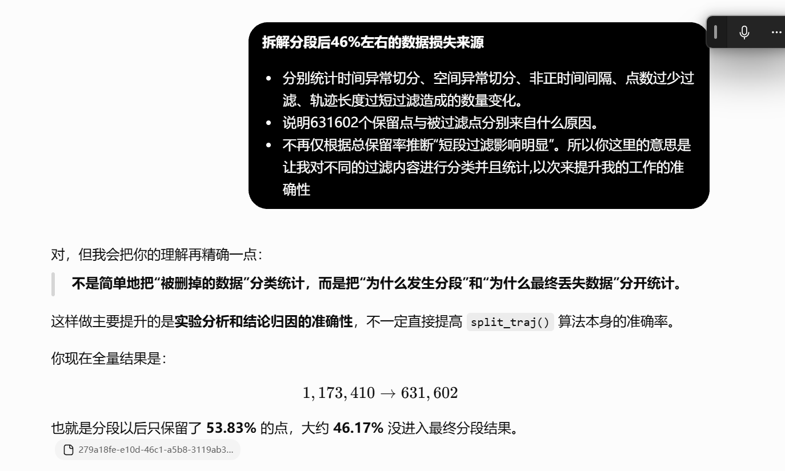
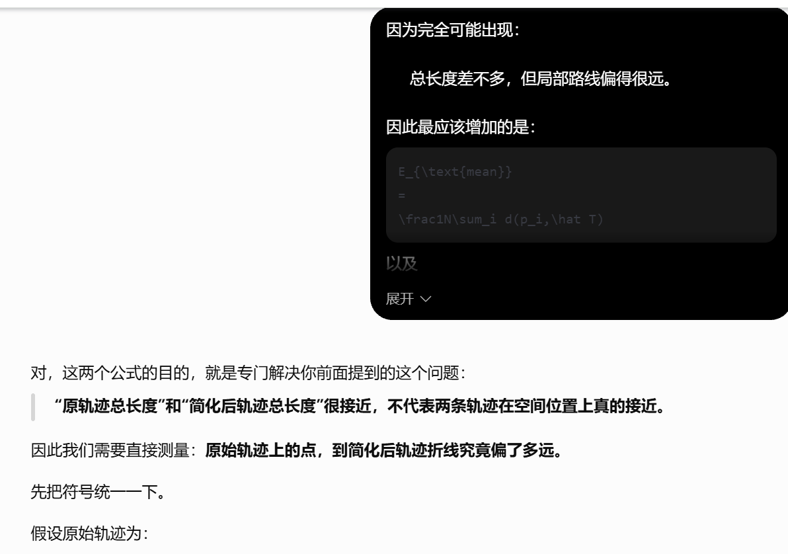

# 实验一《轨迹数据预处理》AI 使用记录与报告内容草案

> 本稿只记录 `作业1轨迹数据预处理.ipynb` 的修改与验证。提交前应由学生逐项核对，并确保能够解释所采用的代码、指标和结论。

## 一、报告正文建议结构

实验报告正文建议围绕当前 Notebook 展开，按以下顺序组织：

1. 实验目的、数据结构与参数单位。
2. 轨迹分段方法与数据损失账本。
3. 轨迹去噪方法与合成真值验证。
4. Douglas–Peucker 简化与局部米制投影。
5. 分段规则一致性检查和独立速度指标。
6. 三组参数敏感性实验。
7. 真实轨迹处理前后可视化。
8. AI 线性插值建议的反例分析。
9. 程序不变量、运行性能、结论与局限性。

报告应区分三类证据：规则是否正确执行、代理指标是否改善、真实轨迹是否更合理。三者不能相互替代。

## 二、我对初版 Notebook 提出的修改建议

以下段落可用第一人称写入报告或 AI 使用记录：

> 我在检查初版 Notebook 后，没有把“代码可以运行”作为完成标准，而是进一步检查了指标是否独立、参数是否具有明确物理含义，以及结果能否由其他人复核。我重点提出了以下改进方向：统一距离口径，区分规则一致性和真实质量，把分段后的点数损失拆成可核对的账本，为 DP 增加点到折线的几何误差，使用固定随机种子和分层样本进行参数实验，并用真实轨迹和合成真值分别验证算法。对于无法由现有数据证明的结论，我将表述改为保守描述，并明确记录局限性。

具体要点如下：

1. **统一距离与投影口径。** 分段使用地表距离；DP 使用上海所在 UTM 51N 的局部米制坐标，避免把 Web Mercator 的投影距离直接解释为真实地面米数。
2. **区分规则检查与质量评价。** 分段后的规则违规率为 0 只能说明既定规则被执行，不能独立证明轨迹质量已经改善；因此增加速度 P95、P99 和超 25 m/s 比例。
3. **拆解点数损失。** 单独统计非正时间间隔切分、时间切分、空间切分、点数不足过滤和长度不足过滤，不再只根据总保留率推断原因。
4. **补充 DP 几何误差。** 在压缩率、长度变化和端点保持之外，计算原始点到简化折线的平均、P95 和最大距离。
5. **加强去噪验证。** 使用正常直线、90°转弯、U-turn、静止 GPS 抖动和单点漂移等合成案例，检查应保留和应删除的点。
6. **改进参数实验采样。** 使用固定随机种子，并按低、高净位移各抽 250 条轨迹；三组参数实验共用同一批 500 条轨迹。
7. **增加真实轨迹图。** 分别展示中断轨迹、漂移候选轨迹和弯道较多轨迹，标记切断位置、删除点及 DP 保留点。
8. **整理 DP 实现。** 保留索引式 DP，避免重复坐标通过坐标值反查索引造成歧义；删除多套相互独立但未解释的实现路径。
9. **把阈值显式参数化。** 让分段、去噪和简化函数接收阈值参数，使参数实验不需要反复修改全局变量。
10. **增加拓展实验和不变量。** 将动态距离约束作为固定 400 m 基线的补充比较，并检查长度一致、时间严格递增、分段最小点数和长度、DP 首尾点保持等条件。
11. **记录全量运行时间。** 报告分段、去噪和简化三个阶段的耗时，但不把效率作为实验核心结论。
12. **修正过强表述。** 将“删除少说明误删少”“异常率为 0 说明清洗有效”“5 m 最优”等说法改成能够由当前证据支持的表述。

## 三、修改前位置、我的建议与修改后位置

“修改前位置”均指原始 `作业.zip` 中的 Notebook；“修改后位置”指当前 Notebook。Cell 编号从 0 开始。

| 修改前位置与内容 | 我提出的问题或建议 | 修改后位置与处理 |
| --- | --- | --- |
| 原 Cell 1：只列出全局阈值，DP 5 m 没有说明投影口径 | 给每个阈值标明单位和物理含义，并让核心函数显式接收参数 | 当前 Cell 2、5、7、11：统一写明米、秒、度；三个函数均可传入阈值 |
| 原 Cell 2：`transform_points_wgs84_to_mercator` 后直接做 DP | Web Mercator 在上海会放大尺度，DP 容差不能直接解释为真实地面米数 | 当前 Cell 0、2、3：改用 UTM 51N；5 m 表示局部地面近似 5 m |
| 原 Cell 2：通过 `item in temp_list` 用坐标值反查索引 | 重复坐标可能对应多个时间戳，应直接在 DP 递归中保存索引 | 当前 Cell 3：统一为索引式迭代 DP，输出排序后的保留索引 |
| 原 Cell 4：`split_traj` 只有“待填充” | 实现按非正时间、时间间隔和空间距离切分，并分别记录切分与过滤原因 | 当前 Cell 5、14：完成分段函数和点数损失账本 |
| 原 Cell 6：`denoise_traj` 只有“待填充” | 去噪不能仅看方向突变，还要设置最小位移门槛，避免删除静止抖动和正常转弯 | 当前 Cell 7–9：完成去噪，并增加 5 类合成真值案例 |
| 原 Cell 8：`simplify_traj` 只有“待填充” | 使用统一索引式 DP，并在简化后重新计算速度和方向 | 当前 Cell 11：完成简化函数并重新生成派生字段 |
| 原 Cell 10：只顺序运行三个函数，没有运行时间和点数变化 | 增加全量点数、轨迹数和运行时间统计 | 当前 Cell 13：输出 11,386 辆车的三阶段点数和耗时 |
| 原 Cell 10：没有解释分段后点数为何减少 | 分开统计短点数段和短长度段，不把切分次数误写成丢失点数 | 当前 Cell 14、17：建立守恒账本并解释各字段含义 |
| 原 Cell 12–13：分段超参数实验为空 | 使用固定样本比较时间、距离阈值，三组实验使用同一批样本 | 当前 Cell 18–20：固定种子、低高净位移分层的 500 条样本 |
| 原 Cell 14–15：去噪超参数实验为空 | 比较方向阈值，同时明确删除比例不等于误删率 | 当前 Cell 21–23：比较 20°、35°、50°、70°，并保守解释结果 |
| 原 Cell 16–17：简化超参数实验为空 | 同时比较压缩率、长度变化、端点保持和点到折线误差 | 当前 Cell 24–26：比较 2、5、10、20 m 的完整指标 |
| 原 Cell 18：只在正弦曲线上演示另一套 DP | 参数选择应回到真实轨迹，避免同时保留多套未解释的 DP 逻辑 | 当前 Cell 3、11、25：统一 DP 实现并在真实样本上评价 |
| 原版没有真实轨迹对照图 | 选择中断、漂移和弯道案例，并突出算法实际改变的位置 | 当前 Cell 30–32：三幅处理前后叠加图 |
| 原版没有规则一致性与独立速度指标 | 规则违规率和质量指标应分开解释 | 当前 Cell 15–17：增加速度分位数和超物理速度比例 |
| 原版没有程序不变量检查 | 通过断言检查数据结构和算法基本保证 | 当前 Cell 36–37：全部不变量通过 |
| 原版没有对线性插值建议进行量化反驳 | 使用统一局部投影构造转弯反例，并计算真实偏差 | 当前 Cell 33–35：线性插值点偏离已知道路 47.65 m |

## 四、报告正文中的主要实验结果

### 4.1 全量处理结果

| 阶段 | 点数 |
| --- | ---: |
| 原始数据 | 1,173,410 |
| 分段后 | 631,602 |
| 去噪后 | 628,412 |
| 简化后 | 202,336 |

三阶段运行时间分别为：分段 6.37 s、去噪 7.55 s、简化 8.98 s。

### 4.2 分段损失账本

原始点数满足以下守恒关系：

```text
631,602 个保留点
+ 54,059 个因子轨迹点数不足而过滤的点
+ 487,749 个因子轨迹长度不足 65 m 而过滤的点
= 1,173,410 个原始点
```

切分边界中，非正时间间隔 42,185 次、仅时间超限 6,696 次、仅空间超限 5,576 次、时间和空间同时超限 1,576 次。切分事件本身不直接删除点，真正的点数损失来自切分后对子轨迹的点数和长度过滤。

### 4.3 规则检查与独立速度指标

| 阶段 | 规则违规比例 | 速度 P95 | 速度 P99 | 超 25 m/s 比例 |
| --- | ---: | ---: | ---: | ---: |
| 原始 | 4.822% | 17.564 m/s | 29.418 m/s | 1.528% |
| 分段 | 0.000% | 19.812 m/s | 37.030 m/s | 2.206% |
| 去噪 | 0.082% | 19.822 m/s | 37.011 m/s | 2.207% |

建议采用以下表述：

> 分段后按既定规则检查已无违规相邻点，说明切分逻辑正确执行。速度分位数和超 25 m/s 比例没有同步下降，且样本构成因过滤发生变化，因此不能仅凭规则违规率为 0 推断真实数据质量已经全面改善。

简化后会跨越被删除的中间点，重新形成新的相邻点对，因此相邻点速度和分段违规率不宜直接与原始数据比较。

### 4.4 去噪正确性验证

合成案例包括正常直线、90°转弯、U-turn、静止 GPS 抖动和单点漂移。前四类均按预期保留，单点漂移按预期删除，5 个案例全部符合预期。

方向阈值从 20°增加到 70°时，删除点数由 177 降到 82，删除比例由 0.614%降到 0.284%；超 25 m/s 比例基本保持在 2.12%。这说明规则较为保守，但不能据此直接计算真实误删率。

### 4.5 DP 几何误差与参数选择

| DP 容差 | 压缩率 | 长度变化 | 平均误差 | P95 误差 | 最大误差 |
| ---: | ---: | ---: | ---: | ---: | ---: |
| 2 m | 55.143% | -0.102% | 0.291 m | 1.448 m | 2.000 m |
| 5 m | 67.036% | -0.283% | 0.853 m | 3.599 m | 4.994 m |
| 10 m | 75.887% | -0.615% | 1.982 m | 7.385 m | 9.993 m |
| 20 m | 82.280% | -1.084% | 4.014 m | 13.900 m | 19.998 m |

全量 5 m 简化的压缩率为 67.80%，路线长度变化为 -0.28%，点到简化折线的平均、P95、最大误差分别为 0.89、3.65、5.00 m，所有轨迹端点均保留。

建议采用以下结论：

> 5 m 在当前样本上表现出较明确的压缩率与几何误差折中，可以作为本实验的候选基准值。它仍不是普遍最优参数，实际应用还需结合定位精度、道路等级和业务允许误差确定。

### 4.6 分段参数实验

固定空间阈值 400 m 时，时间阈值由 15 s 增加到 30 s，点数保留率由 29.37%增加到 56.02%；继续增加到 120 s 时保留率为 56.74%。因此可以写成“30 s 以后保留率增幅明显变小”。

固定时间阈值 30 s 时，空间阈值由 PPT 骑行示例的 95 m 增加到车辆数据基准 400 m，点数保留率由 34.58%增加到 56.02%。这说明 95 m 不适合未经验证地直接套用到当前车辆数据。

### 4.7 动态空间阈值拓展

在同一批 500 条样本中，增加“25 m/s × 实际时间差 × 1.5”的动态约束后：

- 新增 337 个切分边界；
- 保留率由 56.02%降至 55.24%；
- 速度 P99 由 35.96 m/s 降至 25.38 m/s；
- 超 25 m/s 比例由 2.12%降至 1.10%。

该结果说明动态约束能够针对速度异常进行更严格的筛查，但额外过滤约 399 个点。在没有道路真值和人工标签的情况下，应把它作为拓展对照，不直接替换固定 400 m 基线。

### 4.8 真实轨迹可视化

- 轨迹 2200：检测到 5 个切分位置，最终保留 2 个子轨迹。
- 轨迹 7552_1：去噪规则删除 8 个漂移候选点。
- 轨迹 7355_0：DP 将 101 个点简化为 61 个点，并保留关键弯道形状。

图形用于解释算法改变了什么，但不等同于人工真值标注。漂移案例仍应表述为“候选点”或“目视上偏离局部路线的点”。

### 4.9 AI 线性插值建议反例

构造一条先向北、再向东的 90°转弯路线。若只连接缺口两端做线性插值，中点会偏离已知道路 47.65 m。由此拒绝“所有缺失点统一线性插值”的建议。长缺口应优先分段；短缺口是否插值也需要运动状态和道路几何信息。

### 4.10 局限性

1. 当前没有人工标注的漂移真值，真实误删率无法直接计算。
2. 没有接入真实道路中心线，点到简化折线误差属于内部几何保真指标。
3. 65 m 最短长度可能过滤真实的短距离活动或静止片段。
4. 25 m/s 是宽松的城市机动车筛查阈值，不是所有道路和车辆的统一物理上限。
5. 合成案例可以验证规则逻辑，不能代替大规模真实数据人工核验。

## 五、Notebook 范围内的 AI 使用记录

### 使用记录 1：读取任务要求

**提示词摘要：**阅读课程 PPT 和原始 Notebook，确定三个必做函数及选做参数实验。

**AI 辅助内容：**定位课程要求、原始待填充单元和参数说明。

**我的处理：**要求先以课程 PPT 和原始压缩包为准，不直接根据现有修改版反推任务要求。

我在开始编写代码前，先要求 AI 按老师提供的框架解释数据结构和三个处理阶段的职责，而不是直接生成答案。通过这次交互，我确认了原始字典由时间戳和经纬度坐标组成，主流程为 `split_traj → denoise_traj → simplify_traj`，并决定先实现可解释的基础版本，再增加参数实验和验证指标。



*图 1　我要求 AI 先解释老师框架，而不是直接动笔。该交互对应当前 Notebook 的 Cell 1–11。*

### 使用记录 2：完成核心函数

**提示词摘要：**按照 PPT 要求补全分段、去噪和简化函数。

**AI 辅助内容：**生成函数实现草稿，并将速度和方向字段重新计算。

**我的处理：**进一步要求显式参数、统计账本、索引式 DP 和局部米制投影，以便参数实验和结果解释。

### 使用记录 3：提出评价与验证改进

**提示词摘要：**检查当前版本是否存在指标循环定义、物理单位不清和结论过强的问题。

**AI 辅助内容：**协助整理问题清单。

**我的处理：**将建议归纳为距离口径、独立指标、损失来源、几何误差、真值案例、可视化、抽样与不变量八个方面，并据此修改 Notebook。最终选择和表述由我依据课程要求及运行结果确定。

#### 3.1 从循环检查转向独立速度指标

我注意到异常相邻点的判别条件与 `split_traj` 的入口条件重合，因此主动提出增加异常速度比例来辅助判断分段效果。AI 进一步提醒：速度异常阈值必须独立于 30 s 和 400 m 的分段阈值，否则仍然属于“用同一规则证明自己”。据此，我在当前 Cell 15–17 中加入速度 P95、P99 和超 25 m/s 比例，并把规则违规率明确写成一致性检查。



*图 2　我提出使用异常速度比例，AI 补充了指标必须独立于分段阈值这一限制。*

#### 3.2 拆解分段后的数据损失

在看到原始 1,173,410 个点经过分段后只保留 631,602 个点时，我提出分别统计时间异常、空间异常、非正时间间隔、点数不足和长度不足造成的变化。AI 帮助我进一步区分了“为什么触发切分”和“为什么最终丢失数据”：前者产生边界，后者才真正过滤点。据此，我在当前 Cell 5 和 Cell 14 中加入切分原因计数及点数守恒账本。



*图 3　我提出拆解约 46% 的未保留数据，AI 协助明确切分原因与过滤原因应分开统计。*

#### 3.3 从总长度变化扩展到 DP 几何误差

我认为“简化前后总长度接近”不能证明两条轨迹在空间上接近，因为局部路线可能偏离很远但总长度仍然相似，因此提出直接测量原始轨迹点到简化折线的距离。AI 对这一思路进行了公式化说明。当前 Cell 16 和 Cell 25 最终实现了平均误差、P95 误差和最大误差，并与压缩率、长度变化和端点保持共同用于选择 DP 容差。



*图 4　我提出总长度不足以衡量局部形状，AI 协助将问题转化为点到折线距离指标。*

### 使用记录 4：运行并核对结果

**提示词摘要：**执行 Notebook，检查所有代码单元和关键不变量。

**AI 辅助内容：**运行全量处理、参数实验、图形生成和断言检查。

**我的处理：**不把执行成功等同于算法有效；分别审查规则一致性、速度指标、合成案例和几何误差。

### 使用记录 5：修正结论语言

**提示词摘要：**根据实验数字改写结论，避免过度推断。

**AI 辅助内容：**生成结论草稿。

**我的处理：**保留“候选基准值”“规则较保守”“仍需人工真值”等限定语，并保留不支持原预期的结果。

## 六、AI 建议的采纳、修正和否决

| 建议或说法 | 处理 | 理由 |
| --- | --- | --- |
| 直接将 Web Mercator 投影距离解释为米 | 否决 | 上海地区存在明显比例尺度偏差 |
| 分段后的违规比例为 0，说明清洗有效 | 修正 | 只能证明既定规则被满足 |
| 删除比例较低，说明误删较少 | 修正 | 删除比例不是带真值的误删率 |
| 只看路线总长度变化选择 DP 参数 | 否决 | 总长度可能相近但局部形状已偏离 |
| 5 m 是最优参数 | 修正 | 当前数据只支持将其称为候选基准值 |
| 所有缺失点统一线性插值 | 否决 | 转弯反例中产生 47.65 m 偏差 |
| 使用排序后的 ID 等间隔抽取样本 | 否决 | 容易被轨迹类型或编号分布主导 |
| 动态空间阈值直接替换固定 400 m | 暂不采用 | 缺少道路真值，先作为拓展对照 |

## 七、提交前核对

- [ ] 我能解释分段账本中切分次数与过滤点数的区别。
- [ ] 我能说明规则违规率为 0 为什么不是独立质量证明。
- [ ] 我能解释 DP 点到折线误差如何计算。
- [ ] 我能说明 95 m、400 m、25 m/s 和 5 m 的单位及适用范围。
- [ ] 我能解释合成真值与真实轨迹目视核验的证据边界。
- [ ] 我已核对报告数字与 Notebook 当前输出一致。
