# 《智慧城市与位置服务》实验一：轨迹数据预处理

## 实验报告

| 项目 | 内容 |
|---|---|
| 课程名称 | 智慧城市与位置服务 |
| 实验名称 | 实验一：轨迹数据预处理 |
| 作业内容 | 轨迹分段、去噪、简化、效果评价与进阶探索 |
| 姓名 | 【姓名待填】 |
| 学号 | 【学号待填】 |
| 日期 | 2026 年 9 月 24 日 |

## 摘要

本实验对 11,386 条车辆轨迹、1,173,410 个 GPS 点依次进行分段、去噪和 Douglas–Peucker（DP）简化。分段后保留 631,602 点，未保留点主要来自长度不足 65 m 的候选子段；方向去噪删除 3,190 点；5 m 容差的 DP 简化将去噪结果压缩到 202,336 点，压缩率为 67.80%，原轨迹点到简化折线的平均、P95 和最大距离分别为 0.89 m、3.65 m 和 5.00 m。评价时将保留率、规则一致性、速度异常和几何误差分开解释，避免用算法自身规则证明数据质量。

在基础实验之外，我还沿用助教提供的 LLM 辅助清洗评估框架，完成真实模型接入、实验语义修复、Search Teacher 扩充、固定预算 warm-start 和 Memory/LLM 贡献拆解。结果显示，固定预算下的主要收益来自 Search-verified Episodic Memory；LLM 的额外数值贡献较小且不稳定。补充实验使用 OpenStreetMap 外部道路数据完成固定 12 条 holdout 的真实路网验证。全量任务三部署工作流已完成，覆盖全部 11,386 辆车并获得 11,386 条唯一终态记录。当前最可靠的核心仍是“历史经验检索 + 确定性搜索”，LLM 更适合作为有界的高层区域组织层。

**关键词：** GPS 轨迹；轨迹分段；漂移去噪；Douglas–Peucker；几何误差；LLM；Memory；确定性搜索

---

## 1. 实验目的与数据说明

### 1.1 实验目的

实验课 PPT 要求完成轨迹分段、去噪、简化和预处理效果评价，并检查 AI 建议中的单位、坐标和插值假设。本实验具体完成以下工作：

1. 根据相邻点的时间和空间异常切分轨迹，并过滤过短子段；
2. 根据局部方向与几何关系识别候选漂移点；
3. 使用 DP 算法删除冗余点，比较压缩率与形状误差；
4. 设计相互独立、解释边界明确的评价指标；
5. 通过反例检验 AI 建议，讨论三个预处理步骤的先后关系；
6. 将助教标注的 LLM 选做方案作为进阶探索，验证其真实效果和成本。

### 1.2 数据、坐标与环境

原始数据以车辆标识为键，每条记录包含一组 Unix 时间戳和与之等长的 WGS84 经纬度坐标。数据共 11,386 条轨迹、1,173,410 个点，经度范围为 120.386365°E—121.915853°E，纬度范围为 30.578117°N—32.239372°N，主要覆盖上海及周边区域。

经纬度是角度，不能把坐标差直接解释为米。Notebook 在分段阶段使用 Haversine 地表距离，以保持老师框架中的切分口径；DP、点到折线误差和线性插值反例使用 WGS84 / UTM 51N（EPSG:32651）局部米制坐标。数据范围内 UTM 线性尺度因子约为 0.99973—1.00036，因此 5 m 投影容差可近似理解为 5 m 地面距离。

| 项目 | 实际环境 |
|---|---|
| 操作系统 | Windows 11 家庭中文版，10.0.26200，64 位 |
| CPU | AMD Ryzen 9 7940HX with Radeon Graphics，16 核 / 32 逻辑处理器 |
| 内存 | 约 15.2 GiB 可见物理内存 |
| Python | 3.12.6 |
| 主要载体 | Jupyter Notebook、Python 源码、JSON/JSONL 实验记录 |

---

## 2. 轨迹分段

### 2.1 问题与实现逻辑

GPS 信号遮挡、设备停机或上传故障会造成长时间缺口；定位失败也可能使相邻点在空间上突然跳变。若仍把这些点连成一条连续轨迹，会产生不存在的直线路径，进而污染速度、转向、路线长度和地图构建结果。

`split_traj` 对相邻点计算时间差 `Δt` 和 Haversine 距离 `d`。满足 `Δt ≤ 0`、`Δt > LIMIT_DT` 或 `d > LIMIT_DISTANCE` 时触发切分。当前 `LIMIT_DT=30 s`、`LIMIT_DISTANCE=400 m`。切分只决定新子段的边界，不会直接删除点；候选子段形成后，再过滤点数 `< LIMIT_POINT=5` 或长度 `< LIMIT_LENGTH=65 m` 的子段。

代码把切断原因记录为非正时间、仅时间超限、仅空间超限、时间与空间同时超限四类。这个设计能区分“为什么切出新段”和“为什么子段最终被过滤”，避免把一次切断误写成一个被删除点。

PPT 中的 95 m 来自约 12 s 采样间隔和 25 km/h 骑行速度上界，是骑行场景的示例。当前 400 m 是车辆数据中的候选基准，不能理解为所有交通方式的通用最优值。

### 2.2 全量结果与损失来源

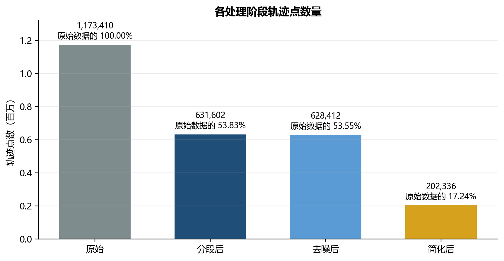

*图 1　全量数据在分段、去噪和简化后的点数变化。*

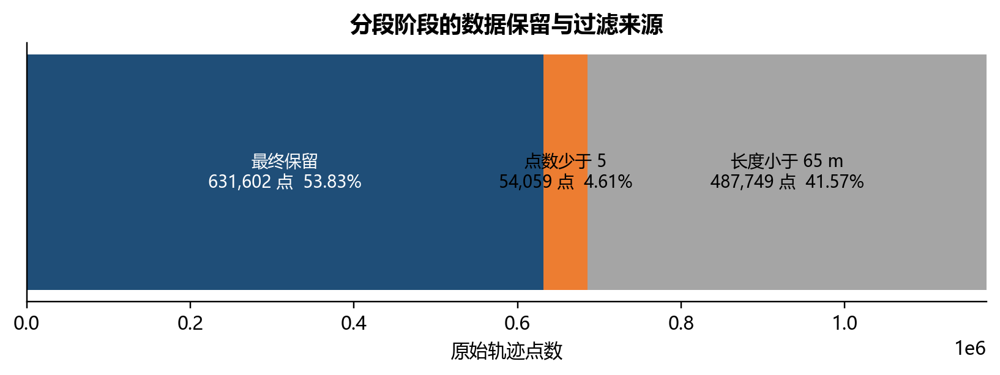

*图 2　分段后保留点与两类过滤点的守恒账本。*

| 结果类别 | 子段数 | 点数 | 占原始点数 |
|---|---:|---:|---:|
| 保留子段 | 19,143 | 631,602 | 53.83% |
| 点数少于 5 | 41,053 | 54,059 | 4.61% |
| 长度小于 65 m | 7,223 | 487,749 | 41.57% |
| 合计 | 67,419 | 1,173,410 | 100.00% |

切断边界共 56,033 个：非正时间间隔 42,185 个，仅时间超限 6,696 个，仅空间超限 5,576 个，时间和空间同时超限 1,576 个。分段后保留 631,602 点，占原始点数 53.83%。约 46.17% 的点没有进入最终子段，其中 54,059 点来自点数不足，487,749 点来自长度不足 65 m。可见主要损失发生在切分后的长度过滤阶段，而不是“触发一次切分就删除一个点”。

65 m 规则也可能过滤真实的停车、短程移动或稀疏采样活动，所以低保留率只能描述数据成本，不能单独证明处理质量。

### 2.3 参数扫描

参数实验使用固定随机种子 20260917，从低、高首尾净位移层各抽取 250 条轨迹，共 500 条、51,478 点。三组实验使用同一批样本，保证参数间可比；该分层样本用于观察趋势，不代表全量类别比例。

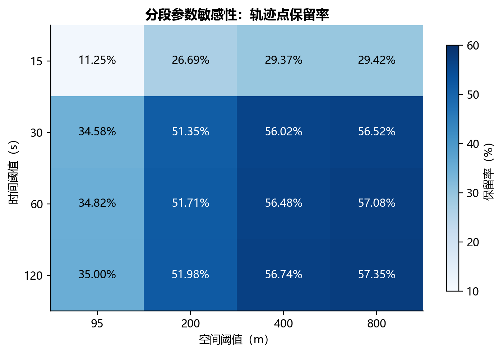

*图 3　时间阈值和空间阈值对保留率的共同影响。*

| 时间阈值 | 95 m | 200 m | 400 m | 800 m |
|---:|---:|---:|---:|---:|
| 15 s | 11.25% | 26.69% | 29.37% | 29.42% |
| 30 s | 34.58% | 51.35% | 56.02% | 56.52% |
| 60 s | 34.82% | 51.71% | 56.48% | 57.08% |
| 120 s | 35.00% | 51.98% | 56.74% | 57.35% |

空间阈值固定为 400 m 时，时间阈值从 15 s 提高到 30 s，保留率由 29.37% 增至 56.02%；继续提高到 120 s，只增至 56.74%。这说明 30 s 之后保留率增幅明显变小，但不能据此称 30 s 为绝对最优。时间阈值固定 30 s 时，95 m 的保留率为 34.58%，400 m 为 56.02%，说明骑行示例阈值对当前车辆数据明显更严格。

### 2.4 规则一致性与独立速度指标

分段后的规则违规比例为 0%，说明所有保留子轨迹均满足既定入口条件。由于这一指标和 `split_traj` 的判断条件基本相同，它只能证明代码按规则执行，不能独立证明现实数据质量改善。

| 阶段 | 正时间相邻点 | 超 25 m/s 数量 | 速度 P95 | 速度 P99 | 超 25 m/s 比例 |
|---|---:|---:|---:|---:|---:|
| 原始 | 1,119,839 | 17,108 | 17.564 m/s | 29.418 m/s | 1.528% |
| 分段 | 612,459 | 13,511 | 19.812 m/s | 37.030 m/s | 2.206% |

超 25 m/s 的绝对数量下降，但比例上升，因为过滤同时改变了分子、分母和样本组成。该结果没有给出“速度质量整体改善”的独立证据，也说明保留率和规则一致性必须配合其他物理指标解释。

---

## 3. 轨迹去噪

### 3.1 GPS 漂移与保守判断

GPS 漂移会把单个点推离真实路线，形成尖锐毛刺，进而夸大速度和路线长度，并制造假转向或假道路。当前 Notebook 以局部方向突变为主要线索，同时要求候选点两侧位移均不小于 5 m，并检查跨过候选点后的直连距离是否小于原两段折线路径。这比“夹角一旦超过阈值就删除”更保守。

设置位移下限是因为静止 GPS 抖动中的短向量没有稳定航向。若直接对厘米到数米级位移计算角度，随机坐标误差会被解释为急转弯。删除候选点后，代码重新计算速度和方向，保持派生字段与坐标数组长度一致。

### 3.2 阈值扫描与实际删除量

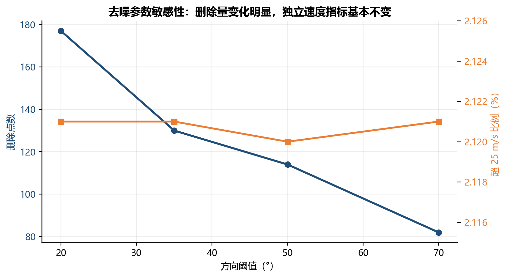

*图 4　方向阈值对删除比例和速度尾部的影响。*

| 方向阈值 | 删除点数 | 删除比例 | 去噪后超 25 m/s 比例 |
|---:|---:|---:|---:|
| 20° | 177 | 0.614% | 2.121% |
| 35° | 130 | 0.451% | 2.121% |
| 50° | 114 | 0.395% | 2.120% |
| 70° | 82 | 0.284% | 2.121% |

阈值越大，删除越保守；但不同阈值下速度尾部几乎没有变化，说明这套规则主要处理局部几何毛刺，没有显示出独立的速度异常改善。全量数据由 631,602 点降至 628,412 点，共删除 3,190 点，约占分段结果的 0.51%。这个比例描述规则强度，不能当作误删率。

### 3.3 合成真值与证据边界

| 合成案例 | 预期 | 实际 | 判定 |
|---|---|---|---|
| 正常直线 | 保留 | 保留 | 符合 |
| 正常 90° 转弯 | 保留 | 保留 | 符合 |
| U-turn | 保留 | 保留 | 符合 |
| 静止 GPS 抖动 | 保留 | 保留 | 符合 |
| 单点漂移 | 删除 | 删除 | 符合 |

五组合成案例均符合预期，说明规则在这些已知结构上能区分正常转向和单点毛刺。真实轨迹没有人工漂移标签，不能由此计算真实准确率、召回率或误删率。去噪删除点后还会形成新的相邻关系，因此重新按分段规则检查时出现少量违规也不等于分段函数失效。

---

## 4. 轨迹简化

### 4.1 Douglas–Peucker 原理与索引实现

DP 算法以一段轨迹的首尾连线为基准，寻找离该线段最远的中间点。若最大距离超过容差，就保留该点并继续处理左右两段；否则删除中间点，只保留首尾点。容差越大，允许忽略的局部偏离越大，保留点通常越少，压缩率越高。

当前代码直接维护原轨迹索引并返回保留索引，避免重复坐标通过坐标值反查时间戳时产生歧义，同时保证首尾点不变。几何运算使用 UTM 51N 米制坐标，`DP_THRESHOLD=5 m` 具有明确的局部地面距离含义。

### 4.2 容差实验与几何误差

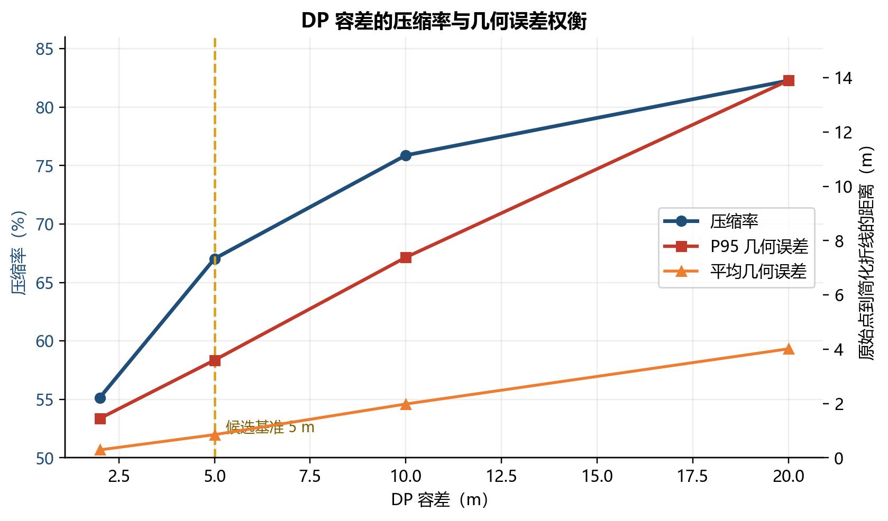

*图 5　不同 DP 容差下压缩率、长度变化和点到折线误差的权衡。*

| 容差 | 压缩率 | 长度变化 | E_mean | E_P95 | E_max |
|---:|---:|---:|---:|---:|---:|
| 2 m | 55.143% | −0.102% | 0.291 m | 1.448 m | 2.000 m |
| 5 m | 67.036% | −0.283% | 0.853 m | 3.599 m | 4.994 m |
| 10 m | 75.887% | −0.615% | 1.982 m | 7.385 m | 9.993 m |
| 20 m | 82.280% | −1.084% | 4.014 m | 13.900 m | 19.998 m |

`E_mean`、`E_P95` 和 `E_max` 分别表示原始轨迹点到简化折线最短距离的均值、95 分位数和最大值。总路线长度接近不能证明局部路线没有偏离：不同位置的局部偏差可能互相抵消，而总长度仍近似不变。因此容差选择必须同时观察压缩率和点到折线误差。

全量 5 m 简化由 628,412 点降至 202,336 点，压缩率为 67.802%；总长度变化 −0.280%；`E_mean=0.891 m`、`E_P95=3.653 m`、`E_max=5.000 m`，全部轨迹首尾点保持不变。5 m 在当前数据上形成了可解释折中，但仍是候选基准，不是跨数据集的绝对最优值。

---

## 5. 轨迹预处理效果评价

### 5.1 为什么需要多类指标

| 指标 | 回答的问题 | 解释边界 |
|---|---|---|
| retention | 处理付出了多少数据损失 | 不判断删除是否正确 |
| rule-consistency | 代码是否满足自身切分规则 | 与算法入口条件重合，不是独立质量证明 |
| speed P95/P99、超 25 m/s | 结果在物理速度尾部是否更合理 | 受时间戳和样本组成影响，不是人工真值 |
| deletion ratio | 去噪规则有多激进 | 不等于准确率或误删率 |
| compression | 简化删除了多少冗余点 | 高压缩可能伴随形状损失 |
| length change | 总路线长度是否明显改变 | 不能反映局部路线偏离 |
| geometric error | 原始点到简化折线的局部偏离 | 尚未评价与真实道路的偏差 |
| synthetic truth | 规则在已知结构上是否符合预期 | 不能替代真实数据标注 |

这些指标测量不同对象。分段规则违规率归零只能回答“程序是否按设定切开”，速度尾部和几何误差才提供相对独立的物理与空间证据；即使它们改善，也仍不能替代人工标注的车辆真实行驶道路路径真值或真实漂移标签。

### 5.2 全量处理链与工程耗时

| 阶段 | 轨迹/子轨迹数 | 点数 | 相对上一阶段变化 | 当前 Notebook 耗时 |
|---|---:|---:|---:|---:|
| 原始 | 11,386 | 1,173,410 | — | — |
| 分段 | 19,143 | 631,602 | −46.17% | 6.37 s |
| 去噪 | 19,143 | 628,412 | −0.51% | 7.55 s |
| 简化 | 19,143 | 202,336 | −67.80% | 8.98 s |

耗时来自当前 Notebook 保存的顺序运行输出，只作为本机工程信息，不参与算法质量判断；系统负载变化可能使重复运行的耗时有所波动。

### 5.3 动态空间阈值对照

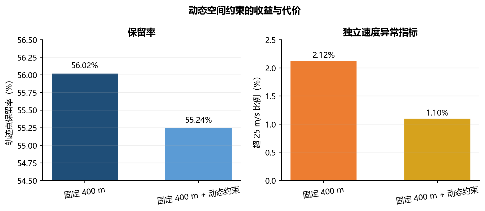

*图 6　固定 400 m 基准与“最大合理速度 × 时间差 × 安全系数”方案的对比。*

在固定 400 m 之外增加 `25 m/s × Δt × 1.5` 的动态约束后，额外切开 337 个边界，保留点从 28,837 降到 28,438，速度 P99 从 35.96 m/s 降至 25.38 m/s，超 25 m/s 比例从 2.12% 降至 1.10%，代价是少保留 399 点。由于时间戳本身可能异常，且当前仍缺少人工标注的车辆真实行驶道路路径真值，本实验将其保留为对照，没有替换老师框架中的固定 400 m 基准。

### 5.4 真实轨迹可视化与不变量

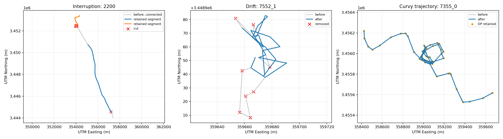

*图 7　GPS 中断、候选漂移和弯道轨迹的处理前后叠加。*

轨迹 2200 检出 5 个切断位置并保留 2 段，若直接跨断点连接会形成虚假路径；轨迹 7552_1 删除 8 个候选漂移点；弯道轨迹 7355_0 从 101 点简化为 61 点，关键转弯附近仍保留控制点。三条轨迹用于解释算法行为，不代表总体准确率。

Notebook 不变量检查全部通过：时间戳和坐标数组始终等长；保留子轨迹内部时间戳严格递增并满足点数、长度下限；删除或简化后速度、方向数组与轨迹结构一致；简化后点数不增加且首尾点不变。

---

## 6. AI 生成建议的批判与思考讨论

### 6.1 单位、坐标与几何口径

AI 容易把“25 km/h”和“25 m/s”写成相似数字，但两者分别约为 6.94 m/s 和 90 km/h，代表不同交通场景。所有阈值必须带单位，并追溯到采样周期、交通方式或物理上限。

直接在经纬度上做欧氏距离会把角度当成米；Web Mercator 虽输出米制坐标，但在上海约 31.23°N 的尺度约放大 `1/cos(31.23°)=1.1708`，即约 17%。若把这种投影距离当真实地面米数，DP 容差和异常阈值会被系统性误读。本实验使用 UTM 51N；进阶代码使用基于 WGS84 曲率半径的上海局部米制展开，并用测试防止退回 Web Mercator。

几何指标也必须与轨迹对象匹配。早期用离散顶点集计算 Hausdorff 时，车辆 246 得到 548.10 m；改成点到折线段的连续口径后为 3.87 m，同一实验的 DP 最大偏差为 4.77 m，二者回到同一量级。顶点集版本没有程序错误，却因简化后顶点稀疏而严重高估距离。

### 6.2 航向噪声与插值反例

在静止 GPS 抖动上直接计算航向，会把随机坐标误差解释成急转弯。抽样排查曾在一条静止轨迹上得到 37 个 turn-angle 和 37 个 U-turn，在车辆 306 上一度把 56/111 点判为漂移。加入 10 m 噪声地板和更保守的相对曲率判断后，真实行驶轨迹的候选误判比例降到 0—7.6%，合成单点毛刺仍能命中。

“缺失点一律线性插值”隐含缺失期间沿直线、近似匀速运动。在构造的 90° 转弯轨迹中，直接连接缺口两端所得中点偏离已知道路折线 47.65 m；距离使用 UTM 51N 重新计算。转弯、掉头、路口选择和绕行都会破坏直线假设，所以长缺口优先分段，短缺口也必须结合运动状态与道路约束判断。

### 6.3 被拒绝或修正的建议

| 建议或早期实现 | 处理 | 理由 |
|---|---|---|
| 所有缺失段线性插值 | 拒绝 | 隐含直线匀速假设，转弯反例偏离 47.65 m |
| 经纬度直接作为平面米制坐标 | 拒绝 | 单位错误，东西向尺度随纬度变化 |
| Web Mercator 直接解释为地面米 | 拒绝 | 上海纬度附近尺度约放大 17% |
| 离散顶点集 Hausdorff 评价简化 | 修正 | 顶点稀疏造成 548.10 m 假大值 |
| 小位移也按航向角删除 | 修正 | 静止抖动没有稳定航向 |
| 规则违规率 0% 即清洗有效 | 拒绝 | 与分段入口条件重合 |
| 删除比例低即误删率低 | 拒绝 | 没有真实标签 |
| 总长度接近即可证明 DP 保真 | 拒绝 | 总量不能反映局部偏离 |

### 6.4 三个步骤能否调换顺序

当前 `split → denoise → simplify` 是更合理的默认顺序。先分段可消除真实时间和空间断裂，否则去噪或简化可能跨中断连接无关点；再去噪可移除明显毛刺，否则 DP 可能把漂移点当成形状关键点保留；最后简化可在连续性较好、毛刺较少的轨迹上删除冗余点。若先简化，还可能提前删除判断漂移所需的局部几何上下文。

其他顺序可以作为实验变量研究，但三个步骤并非可任意交换，因为每一步都会改变下一步的相邻关系和统计分布。

---

## 7. 基础实验总结

基础实验完成了分段、去噪和 DP 简化，并为每一步建立了可核对的证据。分段后的 0% 规则违规证明代码满足既定条件，但独立速度指标没有证明质量整体改善；46.17% 的未保留点主要来自 65 m 最小长度过滤。去噪在五组合成案例上符合预期，全量删除约 0.51%，但缺少真实标签，不能报告准确率。5 m DP 在全量数据上获得 67.80% 压缩率、3.65 m 的 P95 几何误差和 5.00 m 最大误差，可作为当前数据的候选基准。

当前基础实验的主要限制是缺少真实漂移标注、交通方式标签和人工标注的车辆真实行驶道路路径真值。30 s、400 m、35° 和 5 m 只能解释为当前数据与任务下的候选参数；更换采样机制、交通方式或下游任务后，需要重新运行敏感性实验和形状核验。

---

# 进阶探索：基于 LLM 辅助的轨迹数据清洗评估

### 助教方案与第一轮真实模型

这项探索以助教原始系统为起点。原方案已有 Diagnosis Card + handle、物理先验、Search、Objective/regret、四层 Memory 和留出集消融；LLM 提建议，Search 与 Verifier 负责数值计算。原系统能离线跑通，但尚无真实模型消融和可测 Memory 增益。

第一轮接入真实 `ecnu-plus`，固定 12 条 demo、12 条 holdout、3 次重复；二者零重叠，holdout 只读，deterministic 模式为 0 LLM。运行后发现一批不报错却会改变结论的问题：三层参数记录不清、合法取整被算作越界、Search best 被 proposal 覆盖、存在未执行参数、runtime 和缺失 road 污染质量分、stationary 进入可检索 Memory，以及重复与 retry 统计问题。

修复后只开放三个真实执行参数，runtime 单列，road 缺失时重归一化，短静止轨迹设为 `applicable=False`，并按车辆聚类统计。最终完整回归测试记录为 340 passed。三个 LLM 模式的 score delta 为 `−0.000702`、`+0.001397`、`+0.001347`，95% CI 均跨 0；0 LLM 的 deterministic search 为 `+0.131676 [0.023094, 0.338599]`。因此 LLM 直接输出连续参数没有稳定优势。

严格准入后，三轮 admitted 仅 3/3/4，L2 region 为 0；Memory − no-memory 为 `−0.000049 [−0.002513, 0.002879]`。问题被定位为 moving 类型经验不足。

### Search Teacher 与角色调整

下一轮用确定性搜索生成 search-verified experience。Search Teacher 覆盖 200 辆、11,000 次评价、约 639.1 s、0 LLM，与 holdout 零重叠；规模比较 12/24/48/100/200。LLM 改为提议参数区域，最终参数交给固定预算搜索。

budget=10 时，Episodic-only 的 Gap-to-Search 随 Teacher 增加为 `0.1159 → 0.0801 → 0.0421 → 0.0083 → 0.0009`。经验规模确实改善了课程 Objective 下的固定预算搜索质量，但该指标不是真实轨迹质量的真值。

### 最终贡献拆解、标尺与成本

最终加入完全 0 LLM 的 episodic-region-search 和 procedural-region-search，并按相同 vehicle、repetition、budget 配对。Teacher=200、budget=10 时：

| 对比 | 平均 Objective 差值 | vehicle-cluster 95% CI |
|---|---:|---:|
| Episodic deterministic − Pure | +0.1140 | [0.0014, 0.3342] |
| LLM Episodic − Episodic deterministic | +0.0051 | [−0.0019, 0.0145] |
| Procedural deterministic − Pure | +0.0085 | [0.0018, 0.0170] |
| LLM Procedural − Procedural deterministic | −0.0029 | [−0.0079, 0.0001] |

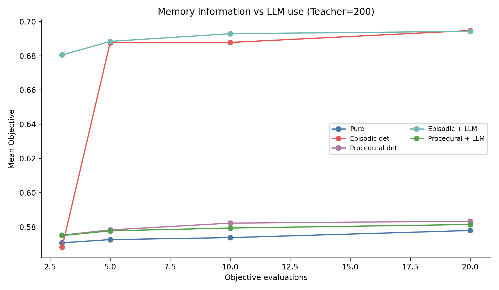

*图 8　确定性 Memory 区域与 LLM 增量贡献的配对消融。*

Episodic 确定性区域的区间不跨 0，而 LLM 增量区间跨 0，说明主要收益来自历史高分参数。Procedural L2 有少量价值，当前 LLM 利用方式没有额外稳定收益。

早期 CD60 参考被部分 warm-start 超过，因此最终标尺改为 `max(old CD60, global Halton512, four multi-start CD60)`。强化后的有界参考平均提高 0.012038，负 gap 从 248/2400 降到 0/2400；新增 5,557 次唯一 Objective 计算、0 LLM。它仍只是有限参数空间和有限预算下的参考，不能解释为全局最优。

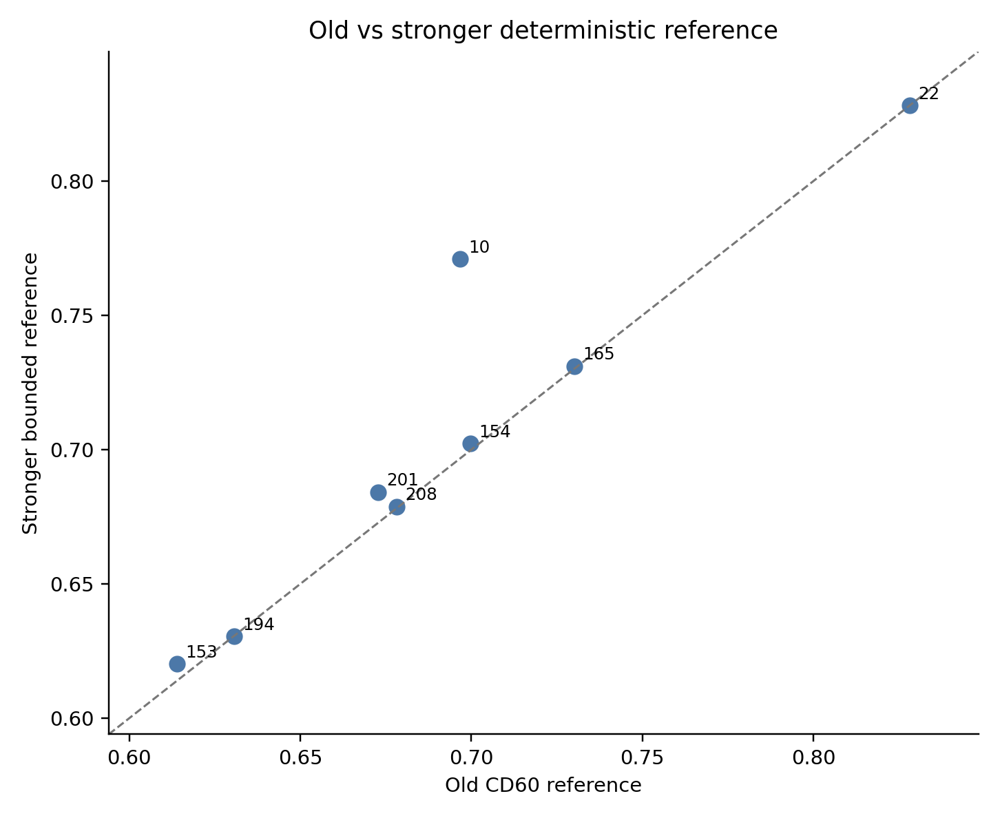

*图 9　旧 CD60 参考与强化后的有界参考对比。*

budget=10 时，Pure Search 在线约 1,269.4 ms，Episodic LLM warm-start 约 2,631.1 ms；两者都用 10 次 Objective evaluation，当前不存在总耗时摊平点。方法提高的是固定评估预算下的解质量，不能写成“LLM 让系统更快”。

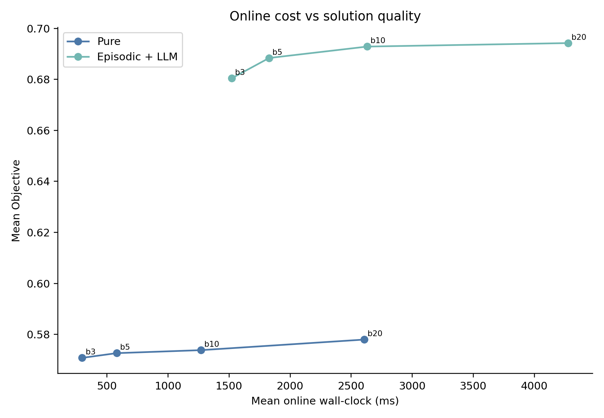

*图 10　固定预算下的在线耗时与 Objective 表现。*

### 真实 OSM 路网约束验证

固定 12 条 holdout 按轨迹 bbox 加 300 m 缓冲，从 OpenStreetMap 获取可驾驶 `highway` 折线并缓存。匹配使用 WGS84 / UTM 51N（EPSG:32651）计算米制距离，最近道路查询使用 Shapely `STRtree`。逐轨迹缓存中的道路 feature 合计 8,871 条；其中带真实 `maxspeed` 的 feature 占 4.06%，其余可识别道路按 `highway` 等级使用明确标记的 fallback 限速。

12 条轨迹全部完成有/无路网对照。原始轨迹加权 match rate 为 72.05%，无路网处理结果为 92.56%；道路吸附实际改变 336/363 个处理后点，逐轨迹平均吸附位移均值为 4.11 m，最大为 29.61 m，未产生退化轨迹。处理后可比较速度点中真实 `maxspeed` 与等级 fallback 分别占 7.38% 和 92.62%，道路限速超限率为 20.92%。Road-aware 的点到道路距离下降，但 match rate 没有进一步提高，因为超过 30 m 阈值的 27 个点保持原坐标，没有被强行吸附。

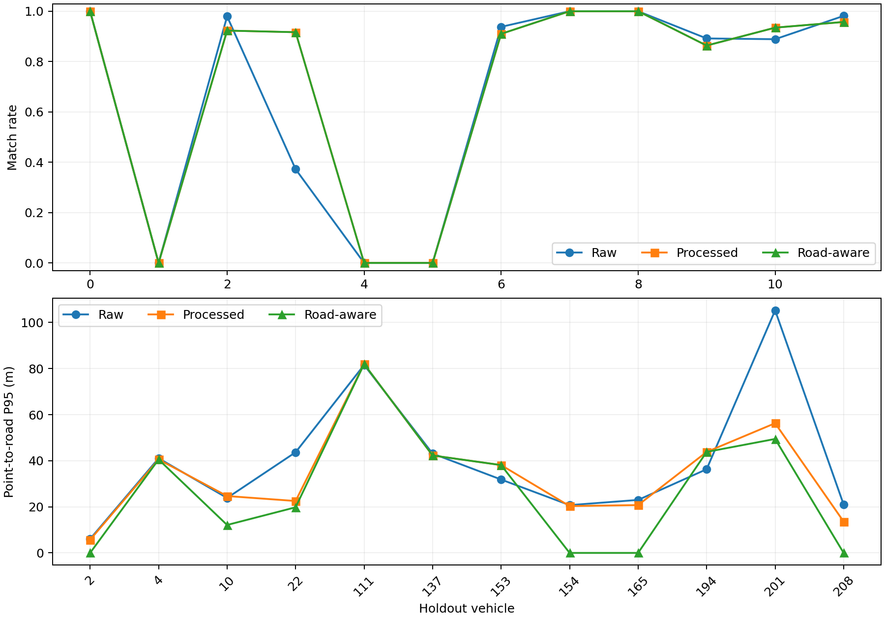

*图 11　固定 12 条 holdout 的原始、处理后和 Road-aware 路网指标。*

这项结果证明真实外部路网和 `apply_road_constraint` 工具路径已被执行，不能证明最近几何道路就是车辆实际行驶道路。立交、平行道路和缺少方向信息仍会造成歧义。因此路网指标作为独立 validation 保存，没有加入或改写历史主 Objective。

### 全量 11,386 条任务三部署工作流

部署策略在运行前冻结：先生成 Diagnosis Card 和默认 Objective；不适用的轨迹直接进入 `not_applicable`；top-1 Search Teacher 相似度不低于 0.75 时运行预算为 3 的 Episodic 区域搜索；低相似样本中前 8 条进入真实 `ecnu-plus` 区域提议，其余进入明确记录的确定性 capacity fallback。该设置用于完成可恢复的全量部署验证，不用于重新调整主结论。

最终得到 11,386/11,386 条唯一 terminal record，覆盖率 100%，missing、duplicate、pending 和 permanent error 均为 0。路由结果为：`not_applicable` 5,464 条、Episodic Memory 5,318 条、真实 LLM 8 条、确定性 fallback 596 条。8 次真实 API 请求消耗 8,047 prompt tokens 和 659 completion tokens，累计 LLM 延迟 18.83 s；确定性搜索共执行 17,766 次评价，总 wall-clock 为 2,643.33 s。

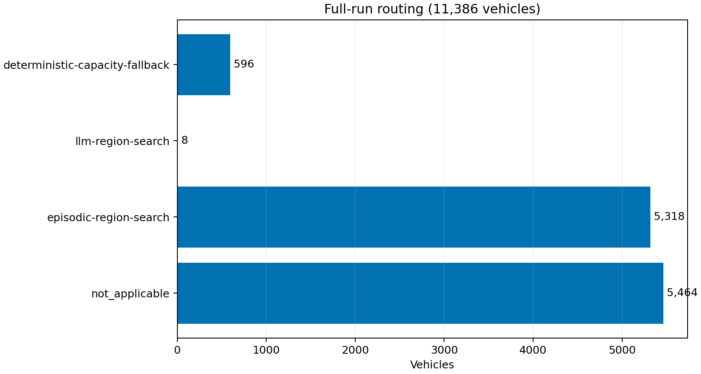

*图 12　11,386 辆车的部署路径分布。*

运行先在第 250 条主动中断并恢复，随后又在 3,586 条附近因 Windows 状态文件锁意外中断；两次都根据已 `fsync` 的 JSONL terminal vehicle_id 继续，最终没有重复记录。全量实验验证的是覆盖、路由、成本和恢复能力，没有为每辆车运行 strong reference，因此不报告伪造的逐车 Gap-to-Search。三条适用路线的 Objective 均值不能直接比较为方法因果效果，因为进入各路线的样本难度不同。

### 进阶探索结论

最终最稳定的核心是“已验证历史经验检索 + 确定性搜索”。Episodic Memory 改善固定预算 Search，Procedural Memory 有较小价值，LLM 增量有限且无时间优势；LLM 主要承担参数区域提议，不能替代确定性搜索与真实标签。真实 OSM road constraint 已完成正式验证，全量 11,386 条任务三部署工作流已完成，记忆增益、真实 LLM 消融、真实 OSM 路网约束和全量部署四项完成度均为 PASS；历史 Objective 和旧实验没有被覆盖。结论仍受固定 12 辆路网 holdout、单一模型、有界参考、缺少人工标注的车辆真实行驶道路路径真值和全量样本未逐车运行 strong reference 的限制。

---

## 参考资料与可复现证据

1. 《智慧城市与位置服务》实验课 1 课件：`实验课1.pptx`。
2. 轨迹预处理 Notebook：`作业/作业1轨迹数据预处理.ipynb`。
3. 基础预处理评估：`作业/轨迹数据预处理评估报告.md`。
4. LLM 工作流代码：`作业/traj_agent/`；任务三 Notebook：`作业/任务3_LLM辅助评估清洗.ipynb`。
5. 修复版真实模型消融：`作业/experiments/llm_assisted_ecnu_20260921_v2/`。
6. Search Teacher 与 warm-start：`作业/experiments/objective_optimization_20260922/`。
7. stronger reference、Memory/LLM 拆解与成本实验：`作业/experiments/objective_optimization_refined_20260922/`。
8. 真实 OSM 路网实验：`作业/experiments/task3_real_road_20260924/`。
9. 全量 11,386 辆部署实验：`作业/experiments/task3_full_11386_20260924/`。
10. OpenStreetMap contributors，ODbL 1.0，`https://www.openstreetmap.org/copyright`。
11. Douglas, D. H., & Peucker, T. K. (1973). *Algorithms for the Reduction of the Number of Points Required to Represent a Digitized Line or Its Caricature*. The Canadian Cartographer, 10(2), 112–122.
