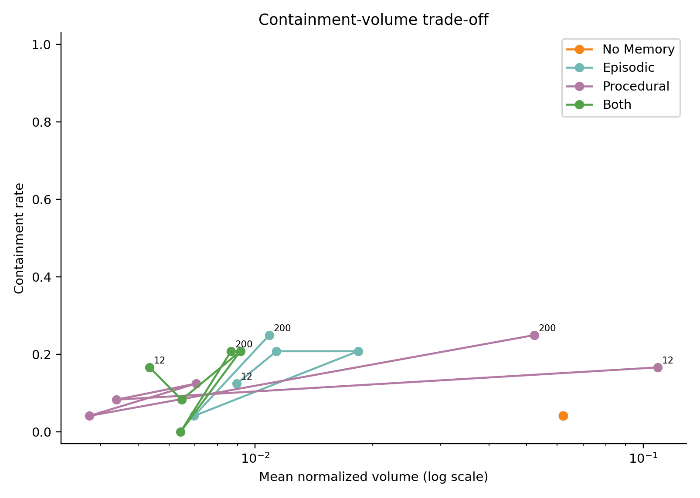
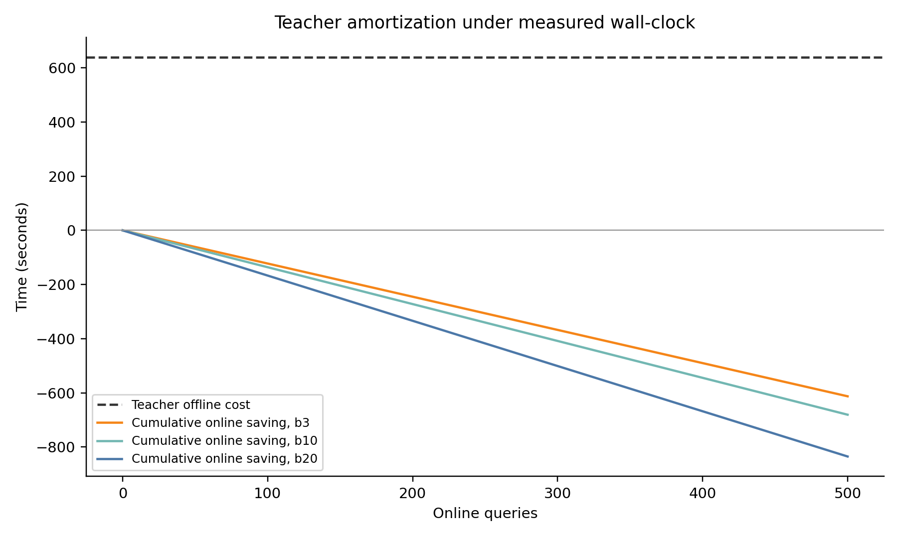

# 《智慧城市与位置服务》实验一：轨迹数据预处理

## 实验报告

| 项目 | 内容 |
|---|---|
| 课程名称 | 智慧城市与位置服务 |
| 实验名称 | 实验一：轨迹数据预处理 |
| 作业内容 | 轨迹分段、去噪、简化、效果评价与 LLM 辅助参数决策 |
| 姓名 | 【姓名待填】 |
| 学号 | 【学号待填】 |
| 日期 | 2026 年 9 月 22 日 |

## 摘要

本实验对 11,386 条车辆轨迹、1,173,410 个 GPS 点依次进行分段、去噪和 Douglas–Peucker（DP）简化。分段后保留 631,602 点，点数损失主要来自长度不足 65 m 的候选子段过滤；方向去噪删除 3,190 点；5 m 容差的 DP 简化将去噪结果压缩到 202,336 点，压缩率为 67.80%，原轨迹点到简化折线的平均、P95 和最大距离分别为 0.89 m、3.65 m 和 5.00 m。实验将“是否满足分段规则”和“数据质量是否改善”分开评价，并用固定随机样本、合成真值案例、真实轨迹叠加图和程序不变量检查结果。

在拓展任务中，我实现了“Diagnosis Card + handle—LLM 提议—确定性执行—Objective 核验—Memory 复用—留出集消融”的工作流。进一步实验发现，固定预算下的主要增益来自 Search-verified Episodic Memory，而 LLM 的额外数值贡献较小且不稳定；同时，LLM API 延迟使在线 wall-clock 时间变长。这个负结果使系统定位从“让 LLM 直接寻找最优数值”收缩为“让语言层解释诊断并提出候选区域，再由确定性搜索完成数值核验”。

**关键词：** GPS 轨迹；轨迹分段；漂移去噪；Douglas–Peucker；几何误差；LLM；Memory；确定性搜索

---

## 1. 实验目的与任务范围

本实验依据实验课 PPT 完成以下内容：

1. 根据相邻点的时间与空间异常切分轨迹，并过滤点数过少或长度过短的子段；
2. 根据局部方向和几何关系识别候选漂移点，减少 GPS 毛刺对后续分析的影响；
3. 使用 DP 算法删除冗余点，并评价压缩率与几何形状误差；
4. 设计互补指标，说明每个指标评价的对象、作用和局限；
5. 批判性检查 AI 建议中的单位、坐标、插值和几何距离假设；
6. 完成 LLM 辅助参数决策拓展任务，用确定性程序评价建议，并通过 Memory 与留出集消融分析各组件贡献。

PPT 中的“任务 3”指 DP 轨迹简化；本项目后续材料中的“任务三”指 LLM 辅助实验。为避免混淆，本文分别称为“DP 简化任务”和“LLM 辅助任务”。

---

## 2. 实验数据、坐标口径与环境

### 2.1 数据说明

原始数据以车辆标识为键，每条记录包含一组 Unix 时间戳和与之等长的 WGS84 经纬度坐标。数据共 11,386 条轨迹、1,173,410 个点，经度范围为 120.386365°E—121.915853°E，纬度范围为 30.578117°N—32.239372°N，主要覆盖上海及周边区域。

经纬度是角度，不能直接把坐标差解释为米。本 Notebook 在分段阶段使用 Haversine 地表距离，以保持老师框架中的切分口径；DP、点到折线误差和线性插值反例使用 WGS84 / UTM 51N（EPSG:32651）局部米制坐标。数据范围内 UTM 线性尺度因子约为 0.99973—1.00036，因此 5 m 投影容差可近似理解为 5 m 地面距离。

### 2.2 运行环境

| 项目 | 实际环境 |
|---|---|
| 操作系统 | Windows 11 家庭中文版，10.0.26200，64 位 |
| CPU | AMD Ryzen 9 7940HX with Radeon Graphics，16 核 / 32 逻辑处理器 |
| 内存 | 约 15.2 GiB 可见物理内存 |
| Python | 3.12.6 |
| 主要载体 | Jupyter Notebook、Python 源码、JSON/JSONL 实验记录 |

---

## 3. 轨迹分段

### 3.1 为什么需要分段

GPS 信号中断、设备停机和上传故障会让时间上不连续的点仍留在同一条记录中；定位跳变也会让相邻点在空间上突然跨越很远。若直接连接这些点，会产生不存在的直线路径，并污染速度、转向、路线长度和地图构建结果。因此分段先恢复“单段轨迹内部应连续”的基本条件。

### 3.2 方法与参数

对相邻点计算时间差 \(\Delta t\) 和 Haversine 距离 \(d\)。满足任一条件就切开：

\[
\Delta t \le 0,\qquad \Delta t > 30\text{ s},\qquad d>400\text{ m}.
\]

切分本身不删除点。形成候选子段后，再过滤点数少于 5 或路线长度小于 65 m 的子段。代码把“非正时间”“仅时间超限”“仅空间超限”“时间与空间同时超限”互斥记录，避免同一边界被重复归因。

30 s 和 400 m 是老师框架下的候选基准。PPT 中 95 m 来自约 12 s 采样间隔和 25 km/h 骑行速度上界；它描述骑行示例，不能直接当作当前车辆数据的普遍阈值。

### 3.3 数据损失来源

*图 1　全量数据在分段、去噪和简化后的点数变化。*

*图 2　分段后保留点与两类过滤点的守恒账本。*

| 结果类别 | 子段数 | 点数 | 占原始点数 |
|---|---:|---:|---:|
| 保留子段 | 19,143 | 631,602 | 53.83% |
| 点数少于 5 | 41,053 | 54,059 | 4.61% |
| 长度小于 65 m | 7,223 | 487,749 | 41.57% |
| 合计 | 67,419 | 1,173,410 | 100.00% |

切断边界共 56,033 个：非正时间间隔 42,185 个，仅时间超限 6,696 个，仅空间超限 5,576 个，时间与空间同时超限 1,576 个。切断次数回答“为什么形成新子段”，过滤点数回答“为什么最终没有保留”，两者不能混为一项损失。46.17% 的未保留点中，487,749 点来自长度不足 65 m 的子段，是主要来源。这些点可能包含静止活动或短程移动，所以较低保留率本身不能证明处理正确。

### 3.4 参数敏感性

参数实验使用固定随机种子 20260917，从低、高首尾净位移层各抽取 250 条轨迹，共 500 条、51,478 点。三组参数实验使用同一批样本，以保持可比性；该分层样本用于观察参数趋势，不代表全量类别比例。

*图 3　时间阈值和空间阈值对保留率的共同影响。*

| 时间阈值 | 95 m | 200 m | 400 m | 800 m |
|---:|---:|---:|---:|---:|
| 15 s | 11.25% | 26.69% | 29.37% | 29.42% |
| 30 s | 34.58% | 51.35% | 56.02% | 56.52% |
| 60 s | 34.82% | 51.71% | 56.48% | 57.08% |
| 120 s | 35.00% | 51.98% | 56.74% | 57.35% |

空间阈值固定为 400 m 时，时间阈值从 15 s 提高到 30 s，保留率由 29.37% 增至 56.02%；继续提高到 120 s，只增至 56.74%。因此可以说“30 s 之后保留率增幅明显变小”，不能据此声称 30 s 对所有场景最优。时间阈值固定 30 s 时，95 m 的保留率为 34.58%，400 m 为 56.02%，说明骑行示例阈值对当前车辆数据明显更严格。

### 3.5 规则一致性与独立评价

分段后的规则违规比例为 0%，只说明所有保留子轨迹满足既定切分条件。这一指标和分段入口条件相同，属于代码一致性检查，不能独立证明数据质量改善。

| 阶段 | 正时间相邻点 | 超 25 m/s 数量 | 速度 P95 | 速度 P99 | 超 25 m/s 比例 |
|---|---:|---:|---:|---:|---:|
| 原始 | 1,119,839 | 17,108 | 17.564 m/s | 29.418 m/s | 1.528% |
| 分段 | 612,459 | 13,511 | 19.812 m/s | 37.030 m/s | 2.206% |

超 25 m/s 的绝对数量下降，但比例上升，因为过滤同时改变了分子和分母以及保留样本组成。这个结果没有给出“速度质量整体改善”的独立证据，反而说明评价不能只看一个比例。

---

## 4. 轨迹去噪

### 4.1 问题与实现

GPS 漂移会把单个点推离真实路线，形成尖锐毛刺。毛刺会夸大路线长度和速度，并可能被误识别为急转弯、掉头或新的道路形状。当前 Notebook 以局部方向突变为主要线索，同时增加两侧位移均不小于 5 m、跨过候选点后的直连距离小于原两段折线路径等保守条件。删除点后重新计算速度和方向数组，保持派生字段与坐标长度一致。

方向阈值越小，规则越敏感；越大，删除越保守。加入位移下限的原因是：静止 GPS 抖动中，两个很短向量的航向几乎没有物理意义，直接计算夹角会制造大量假转向。

### 4.2 阈值实验与合成真值

*图 4　方向阈值对删除比例和速度尾部的影响。*

| 方向阈值 | 删除点数 | 删除比例 | 去噪后超 25 m/s 比例 |
|---:|---:|---:|---:|
| 20° | 177 | 0.614% | 2.121% |
| 35° | 130 | 0.451% | 2.121% |
| 50° | 114 | 0.395% | 2.120% |
| 70° | 82 | 0.284% | 2.121% |

不同阈值下速度尾部几乎不变，说明该规则主要处理局部几何毛刺，而没有显示出独立的速度异常改善。删除比例低只能说明规则较保守，不能等同于误删率低。

| 合成案例 | 预期 | 实际 | 判定 |
|---|---|---|---|
| 正常直线 | 保留 | 保留 | 符合 |
| 正常 90° 转弯 | 保留 | 保留 | 符合 |
| U-turn | 保留 | 保留 | 符合 |
| 静止 GPS 抖动 | 保留 | 保留 | 符合 |
| 单点漂移 | 删除 | 删除 | 符合 |

五组合成案例均符合预期，说明规则在这些已知真值结构上能区分正常转向和单点毛刺。真实数据没有人工漂移标签，因此不能据此给出真实准确率、召回率或误删率。

### 4.3 全量结果与局限

全量去噪由 631,602 点降到 628,412 点，共删除 3,190 点，约占分段结果的 0.51%。重新连接删除点两侧后会产生新的相邻关系，所以去噪后重新按分段规则检查得到 0.082% 违规，并不表示分段函数失效。当前证据支持“规则执行较保守并通过合成案例”，不支持“真实漂移全部被正确删除”。

---

## 5. Douglas–Peucker 轨迹简化

### 5.1 算法逻辑与实现

DP 算法以一段轨迹的首尾连线为基准，寻找离该线段最远的中间点：若最大距离超过容差，就保留该点并递归处理左右两段；否则删除中间点，只保留首尾点。容差越大，允许忽略的局部偏离越大，保留点通常越少，压缩率也越高。

实现采用索引式 DP，直接返回保留点索引。这样可以避免重复坐标通过坐标值反查索引时产生歧义，并能保持原时间戳和首尾点。几何距离在 UTM 51N 米制坐标中计算，容差具有明确的米制含义。

### 5.2 压缩率与几何误差

*图 5　不同 DP 容差下压缩率、长度变化和点到折线误差的权衡。*

| 容差 | 压缩率 | 长度变化 | 平均误差 | P95 误差 | 最大误差 |
|---:|---:|---:|---:|---:|---:|
| 2 m | 55.143% | −0.102% | 0.291 m | 1.448 m | 2.000 m |
| 5 m | 67.036% | −0.283% | 0.853 m | 3.599 m | 4.994 m |
| 10 m | 75.887% | −0.615% | 1.982 m | 7.385 m | 9.993 m |
| 20 m | 82.280% | −1.084% | 4.014 m | 13.900 m | 19.998 m |

总路线长度接近并不保证两条轨迹在空间中接近：局部向一侧偏离、另一处向另一侧偏离时，总长度仍可能相近。因此本实验增加“原始轨迹点到简化后折线的最短距离”，并报告均值、P95 和最大值。

全量 5 m 简化由 628,412 点降至 202,336 点，压缩率为 67.802%；总长度变化 −0.280%；平均、P95、最大几何误差分别为 0.891 m、3.653 m、5.000 m，且全部轨迹首尾点保持不变。5 m 在当前样本上形成了压缩率与几何误差之间的可解释折中，但它仍是候选基准，不是跨数据集的绝对最优值。

---

## 6. 预处理整体效果评价

### 6.1 指标设计逻辑

| 指标 | 测量对象 | 设计原因 | 解释边界 |
|---|---|---|---|
| 点数保留率 | 各阶段保留点数 / 上一阶段或原始点数 | 量化数据规模变化 | 不能判断删掉的点是否正确 |
| 分段规则违规比例 | 非正时间、超时间或超距离的相邻点占比 | 检查分段代码是否满足自身规则 | 与算法条件重合，不是独立质量证明 |
| 速度 P95 / P99 | 正时间相邻点速度尾部 | 观察极端运动是否减少 | 受时间戳错误和样本组成影响 |
| 超 25 m/s 数量与比例 | 宽松物理筛查线以上的相邻点 | 提供独立于分段阈值的异常线索 | 不是交通方式标签或人工真值 |
| 去噪删除比例 | 去噪删除点 / 分段点 | 判断规则激进程度 | 不等于准确率或误删率 |
| 压缩率 | \(1-N_{after}/N_{before}\) | 评价存储和计算量降低 | 高压缩可能伴随形状损失 |
| 长度变化 | 简化前后总长度相对变化 | 检查整体路线长度是否明显改变 | 不能反映局部偏离 |
| 点到折线误差 | 原始点到简化折线的最短距离 | 直接评价局部几何保持 | 仍未评价与真实道路的偏差 |
| 合成真值 | 人工构造结构的预期行为 | 核对规则边界 | 不能替代真实数据标注 |

### 6.2 全量处理结果与运行时间

| 阶段 | 轨迹/子轨迹数 | 点数 | 相对上一阶段变化 | 当前 Notebook 运行时间 |
|---|---:|---:|---:|---:|
| 原始 | 11,386 | 1,173,410 | — | — |
| 分段 | 19,143 | 631,602 | −46.17% | 6.37 s |
| 去噪 | 19,143 | 628,412 | −0.51% | 7.55 s |
| 简化 | 19,143 | 202,336 | −67.80% | 8.98 s |

耗时来自当前 Notebook 已保存的顺序运行输出，只作为本机工程信息。它会受 CPU、Python 版本和系统负载影响，不用于判断算法质量。

### 6.3 动态空间阈值拓展

*图 6　固定 400 m 基准与“最大合理速度 × 时间差 × 安全系数”方案的对比。*

在固定 400 m 之外增加 \(25\text{ m/s}\times\Delta t\times1.5\) 的动态约束后，额外切开 337 个边界，保留点从 28,837 降到 28,438，速度 P99 从 35.96 m/s 降至 25.38 m/s，超 25 m/s 比例从 2.12% 降至 1.10%，代价是少保留 399 点。由于时间戳本身也可能异常，且缺少道路真值，本实验把它作为对照结果，没有替换老师框架中的固定 400 m 基准。

### 6.4 真实轨迹可视化与不变量

*图 7　GPS 中断、候选漂移和弯道轨迹的处理前后叠加。*

轨迹 2200 检出 5 个切断位置并保留 2 段，图中可见若直接跨断点连接会形成虚假路径；轨迹 7552_1 删除 8 个候选漂移点；弯道轨迹 7355_0 从 101 点简化为 61 点，关键转弯附近仍保留了控制点。这三条轨迹用于解释算法行为，不代表总体准确率。

Notebook 的不变量检查全部通过：时间戳与坐标数组始终等长；保留子轨迹内部时间戳严格递增且满足点数和长度下限；删除或简化后速度、方向数组与轨迹结构一致；简化后点数不增加且首尾点不变。

---

## 7. AI 生成建议的批判性分析

### 7.1 单位和坐标不能靠语言习惯猜测

AI 容易把“25 km/h”和“25 m/s”写成相似的数字，但两者分别约为 6.94 m/s 和 90 km/h，代表完全不同的交通场景。因此所有阈值在代码和报告中必须带单位，并追溯到采样周期、交通方式或物理上限。

经纬度也是常见错误源。直接在经纬度上做欧氏距离会把角度当成米；Web Mercator 虽然输出米制坐标，但在上海约 31.23°N 的局部尺度约放大 \(1/\cos(31.23^\circ)=1.1708\)，即约 17%。若仍把 5 m 投影距离写成真实地面 5 m，DP 容差和异常距离都会被系统性误读。本 Notebook 采用 UTM 51N；任务三代码采用基于 WGS84 曲率半径的上海局部米制展开，并用回归测试防止退回 Web Mercator。

### 7.2 几何指标必须匹配轨迹对象

早期尝试把简化前后的坐标当作两个离散顶点集合计算 Hausdorff 距离。车辆 246 的简化轨迹顶点较稀疏，离散顶点集口径给出 548.10 m；改为“点到折线段”的连续几何口径后为 3.87 m，同一实验的 DP 最大偏差为 4.77 m，二者回到同一米制量级。这个问题不会让程序报错，却会把几何评价放大两个数量级以上。最终报告用点到折线距离评价简化形状，并把参考轨迹固定为去噪后的同阶段轨迹，避免把去噪形变混进 DP 误差。

### 7.3 静止抖动上没有稳定航向

直接对厘米到数米级 GPS 抖动计算航向，会把随机坐标误差解释成急转弯。抽样排查曾在一条静止轨迹上得到 37 个 turn-angle 和 37 个 U-turn，在车辆 306 上一度把 56/111 点判为漂移。加入 10 m 噪声地板和更保守的相对曲率判断后，真实行驶轨迹的候选误判比例降到 0—7.6%，合成单点毛刺仍能命中。由此拒绝“只要夹角超过阈值就删除”的简单建议。

### 7.4 线性插值反例

“缺失点一律线性插值”隐含了缺失期间沿直线、近似匀速运动的假设。在构造的 90° 转弯轨迹中，直接连接缺口两端得到的插值中点偏离已知道路折线 47.65 m；该距离使用 UTM 51N 重新计算。转弯、掉头、路口选择和绕行都会破坏直线假设，因此长缺口优先分段，短缺口也必须结合时间、运动状态和道路约束判断。

### 7.5 被拒绝或修正的 AI 建议

| 建议或早期实现 | 处理 | 原因 |
|---|---|---|
| 对所有缺失段线性插值 | 拒绝 | 隐含直线匀速假设，转弯反例偏离 47.65 m |
| 经纬度直接作为平面米制坐标 | 拒绝 | 单位错误，东西向尺度随纬度变化 |
| Web Mercator 距离直接解释为地面米 | 拒绝 | 上海纬度附近尺度约放大 17% |
| 用离散顶点集 Hausdorff 评价简化 | 修正 | 顶点稀疏造成 548.10 m 假大值，改为点到折线 |
| 小位移也计算航向并按角度删点 | 修正 | 静止抖动没有稳定航向，加入噪声地板和几何条件 |
| 规则违规率 0% 即证明清洗有效 | 拒绝 | 该指标与分段条件重合，只能证明规则执行一致 |
| 删除比例低即误删率低 | 拒绝 | 没有真实标签，删除比例只反映规则保守程度 |
| 总长度接近即可证明 DP 保真 | 拒绝 | 总量可能抵消局部偏离，增加点到折线误差 |

这部分说明 AI 可以帮助列出候选方法和检查点，但其建议必须经过单位检查、坐标检查、反例和真实实验，不能直接作为事实或最终方案。

---

## 8. LLM 辅助轨迹清洗评估工作流

### 8.1 为什么不能把 117 万点直接交给 LLM（问题 1）

原始坐标序列上下文很长，逐车发送会产生高 token 和调用成本；语言模型也不适合在大量浮点坐标上稳定完成距离、投影和数值搜索。更关键的是，直接暴露坐标会模糊“模型建议”和“确定性计算”的边界。

因此系统只给 LLM 一个轨迹 `handle` 和 Diagnosis Card。handle 指向 Python 进程中保存的真实轨迹；Diagnosis Card 只含标量统计和计数，包括点数、时长、stationary/mixed/moving 状态、时间轴质量、时间间隔分布、长度、位移、包围盒尺度、曲折度、连续重复点比例、速度统计、异常原因计数和可用的道路匹配率。坐标和完整时间序列不进入 LLM 上下文，所有距离和轨迹变换由 Python 工具执行。

### 8.2 为什么先分类（问题 2）

固定随机种子 20260920 抽取的 200 条样本中，stationary、mixed、moving 分别为 94、48、58 条，即 47%、24%、29%；该比例只描述抽样集。三类轨迹的速度、重复点、位移和压缩需求不同：静止轨迹的重复点可能是正常停车，moving 轨迹中的大跳变更值得检查，mixed 轨迹还包含停车和移动状态转换。因此它们不应无条件共享一套参数或评价解释。

当前 Objective 用压缩率和几何保真评价处理方案。当轨迹总长小于 200 m 时，尤其是只有十余米的静止抖动，0.5 m 容差已经接近轨迹尺度，长度比和压缩率不再代表行驶路线质量。代码把这类轨迹标记为 `applicable=False`，保留审计记录，但不计算可比较 regret，也不让它进入可检索 Memory 或 L2 蒸馏。这样避免为了得到一个分数而强迫不适用样本参加同一排名。

### 8.3 LLM 能使用的工具及写入边界（问题 3）

工具注册表提供 15 个确定性工具，可按功能分为：数据载入与诊断、异常检测与参数范围、分段/去噪/简化/道路约束、评价与方案比较、确定性搜索与 knee point、Memory/Playbook 只读查询、结果渲染。典型工具包括 `profile_trajectory`、`detect_anomalies`、`suggest_param_range`、`simplify_trajectory`、`evaluate`、`run_search` 和 `query_memory`。

LLM 负责选择工具、解释诊断和提出候选参数；真正修改轨迹、计算距离与 Objective 的过程由 Python 执行。注册表刻意没有 `write_memory` 或 `write_playbook`。核验器根据可行性、参数边界和 regret 决定是否准入，MemoryStore 才记录案例；L3 人类知识库保持只读，只允许经人工确认后单向导出。这样一次幻觉或格式错误不会直接污染后续检索，generator 与 verifier 的职责也保持分离。

### 8.4 参数如何确定（问题 4）

参数决策分三层：

1. **物理与数据先验限定合法区间。** 例如速度用 m/s，距离用局部米制坐标；采样间隔、城市限速和 GPS 精度决定搜索边界。
2. **LLM 或 Memory 提供候选点/搜索区域。** 它们利用 Diagnosis Card 和相似历史经验缩小范围，不承担最终数值最优化。
3. **确定性 Search 在冻结空间内评价。** 每个候选都执行同一处理链并计算同一 Objective，最终结果可复现、可比较。

主实验只开放实际进入执行链的三个参数：`dp_tolerance`、`dist_threshold`、`max_speed_mps`。其余参数保持默认值，避免出现“模型能够提议、执行器却不读取”的假自由度。按搜索轨迹中的局部变化做尺度归一化后，平均敏感性为：

| 参数 | 平均归一化敏感性 | 排名 |
|---|---:|---:|
| `dp_tolerance` | 0.618479 | 1 |
| `max_speed_mps` | 0.021993 | 2 |
| `dist_threshold` | 0.016177 | 3 |

排序仍为 `dp_tolerance > max_speed_mps > dist_threshold`。它说明在当前课程 Objective 和搜索轨迹中，DP 容差最影响分数；它不是全局因果结论，也没有据此改写搜索算法。

### 8.5 Objective 的含义和限制（问题 5）

Objective 把一次方案的压缩效果和几何保真转成可比较的内部评分。压缩率为 \(1-N_{after}/N_{before}\)；保真度把最大几何偏差按 30 m 尺度映射到 0—1。默认 quality 与 compression 权重均为 1；有真实道路信息时 road 项权重为 0.5，没有道路信息时从分子和分母同时移除，而不是按 0 分处理。runtime 只作为工程指标单独记录，权重为 0，避免亚毫秒级波动改变质量排名。

方案还必须满足两个可行性限制：简化后长度比不低于 0.98，最大偏差不超过本次 DP 容差的 1.5 倍。违反限制的解被排在可行解之后。Objective 是课程内部、基于既定指标的评分标准；分数提高不等于真实 GPS 轨迹一定清洗正确，因为当前没有人工漂移标签和完整道路真值。

### 8.6 如何判定 LLM 建议（问题 6）

每次建议同时保存以下量：

- `baseline_score`：默认参数的分数；
- `proposal_score`：LLM 建议实际执行后的分数；
- `reference_score`：冻结预算下确定性搜索得到的 bounded reference；
- signed gap：`reference_score − proposal_score`，保留正负号以发现参考不够强；
- regret：建议相对 reference 损失了多少可得增益；
- direction accuracy：LLM 预测的指标变化方向与实测方向是否一致；
- constraint satisfaction / feasibility：参数是否越界、结果是否违反长度和偏差约束。

当 `reference − baseline` 足够大时，使用归一化 regret：

\[
R=\frac{\max(0,S_{ref}-S_{proposal})}{S_{ref}-S_{baseline}}.
\]

当 headroom 小于 0.02 时，分母过小会放大微小差异，因此改用绝对 regret；`applicable=False` 时 regret 记为 not applicable，改按 regime 和约束解释。

旧参考只使用 60 次 coordinate descent，后来出现 warm-start 超过参考的负 gap。这说明“裁判”本身也需要核验。最终 stronger bounded reference 定义为：

\[
\max(\text{old CD60},\ \text{global Halton512},\ \text{four multi-start CD60}).
\]

在 8 辆 applicable holdout 上，strong reference 相比旧参考平均提高 0.012038，中位提高 0.001800，6 辆严格提高；最终来源为旧 CD60 2 辆、全空间 Halton 1 辆、多起点 CD 5 辆。旧口径有 248/2400（10.3%）条负 gap，强化后为 0/2400。新增参考实际完成 5,557 次唯一 Objective 计算、0 次 LLM。它仍是固定参数空间和有限预算下的 reference，不能称为 ground truth 或全局最优。

*图 8　旧 CD60 参考与 stronger bounded reference 的对比。*

### 8.7 Memory 的设计与使用（问题 7）

系统把记忆分为四层：

- **Working Memory**：当前轨迹的诊断、工具调用和中间结果，只服务本次运行；
- **Episodic Memory（L1）**：保存“诊断—参数—实测指标—核验结论”的单案例账本。未通过案例也保留用于审计，但默认检索只读 `admitted=1`；
- **Procedural Memory（L2）**：按 regime 和 timeline quality，把通过核验的案例蒸馏为参数 IQR 区间；
- **Human Knowledge（L3）**：人工确认的课程知识和解释，Agent 只读。

早期 v2 只有 12 条 demo，三轮准入数为 3/3/4，L2 region 为 0；Memory 相对无 Memory 的配对均值为 −0.000049，95% CI 为 [−0.002513, 0.002879]。这不是“Memory 永远无用”，而是已验证 moving 案例太少，属于数据饥饿。

后续把 Teacher 规模依次扩展为 12、24、48、100、200。Search Teacher 对 200 辆独立车辆运行确定性搜索，生成 search-verified experience：0 次 LLM，与 holdout 零重叠，也不读取 holdout。它提供的是离线搜索经验，不是把评测答案提前写入 Memory。

### 8.8 Memory 是否有用（问题 8）

Teacher=200 时，Episodic 搜索区域由 top-5 相似案例的参数 P25—P75 构造。其 strong-reference containment 为 25.0%；平均归一化区域体积从 No Memory 的 0.062193 降到 0.010873，缩小 82.5%。这说明区域更集中且覆盖有所改善，但 25% 的绝对覆盖率仍然较低，不能声称已稳定包含最佳参数。

*图 9　搜索区域覆盖率与归一化体积必须共同解释。*

在 budget=10 的配对实验中：

| 对比 | 平均 Objective 差值 | vehicle-cluster 95% CI |
|---|---:|---:|
| Episodic deterministic − Pure | +0.1140 | [0.0014, 0.3342] |
| LLM Episodic − Episodic deterministic | +0.0051 | [−0.0019, 0.0145] |

Episodic 确定性区域相对 Pure Search 的区间不跨 0；加入 LLM 后只增加 0.0051，区间跨 0。当前实验中，大部分收益来自已验证 Episodic Memory 提供的搜索区域，而不是 LLM 的额外数值推理。

### 8.9 Procedural Memory 是否有用（问题 9）

Teacher=200、budget=10 时，`Procedural deterministic − Pure` 为 +0.0085，95% CI [0.0018, 0.0170]，说明 L2 参数区间含有小幅信息价值；`LLM Procedural − Procedural deterministic` 为 −0.0029，95% CI [−0.0079, 0.0001]，当前 LLM 对 Procedural 区域的利用没有形成额外稳定收益。因此 Episodic 是主要贡献来源，Procedural 有较小的可测价值，证据不支持宣称 Both 模式必然最好。

*图 10　确定性 Memory 区域与 LLM 增量贡献的配对消融。*

### 8.10 LLM 的实际价值与限制（问题 10）

真实模型实验使用 `OpenAICompatProvider` 调用 `ecnu-plus`，固定 12 条 demo、12 条 holdout 和 3 次重复，demo 与 holdout 零重叠。修复版 v2 共保留 159 次实际请求记录，prompt/completion token 分别为 406,605 / 31,659；后续 refined 实验复用已经缓存的模型输出，没有为了得到理想结果重新调用模型。该实验中 LLM direct proposal 与确定性搜索存在明显 gap；`llm-only` 相对默认参数的均值为 −0.000702，95% CI [−0.015137, 0.012893]，没有稳定提升。于是系统不再把 LLM 当作最终数值优化器，而让它根据 Diagnosis Card 和 Memory 提出候选搜索区域，再由确定性 Search 精调。

refined 消融又进一步表明，Episodic Memory 自身已经贡献大部分固定预算收益，LLM 增量较小且不稳定。LLM 的现阶段价值主要是提供可解释、可扩展的语言决策层：它能阅读诊断、说明为什么调用某类工具、形成候选区域和预测变化方向；最终数值与结论仍必须交给确定性程序验证。

### 8.11 公平消融与信息泄漏控制（问题 11）

实验把 Teacher/demo 与 holdout 固定为零重叠；holdout 全程只读，Memory 构建和 Search Teacher 都不使用 holdout；相似案例检索默认排除当前 `seg_id`。deterministic teacher 和 deterministic memory search 真实记录为 0 次 LLM。Pure Search 与 warm-start 在同一 budget 下使用相同 Objective evaluation 数，并按同一 vehicle、repetition、budget 配对。

refined 表格的每格包含 8 辆独立车辆、24 条观测和 3 次重复，置信区间以 vehicle_id 为 cluster bootstrap 单位，避免把同一车辆的三次重复当成 24 个独立样本。项目还加入回归测试，锁定合法整数取整不算越界、Search best 不被 proposal 覆盖、runtime 不进入主质量分、road 缺失时重归一化、retry 成本累计但统计结果去重、stationary 不进入可检索 Memory、deterministic 模式保持 0 LLM 等实验语义。最新完整测试为 329 passed。

### 8.12 成本是否降低（问题 12）

*图 11　固定预算下的在线耗时与 Objective 表现。*

| Budget | Pure Search online | Episodic LLM warm-start online | 每次节省 | Break-even |
|---:|---:|---:|---:|---|
| 3 | 296.2 ms | 1,521.9 ms | −1,225.7 ms | N/A |
| 5 | 579.3 ms | 1,827.7 ms | −1,248.4 ms | N/A |
| 10 | 1,269.4 ms | 2,631.1 ms | −1,361.6 ms | N/A |
| 20 | 2,607.4 ms | 4,277.6 ms | −1,670.2 ms | N/A |

budget=10 时，LLM warm-start 因约 1 秒级 API 延迟比 Pure Search 更慢，不存在 wall-clock break-even。200 条 Search Teacher 的离线成本为 11,000 次 Objective evaluations、约 639.1 s、0 次 LLM。固定预算设计中 Pure 与 warm-start 都使用相同 evaluation 数，所以直接 evaluation 节省也为 0。

在 budget=20 且以 strong reference 的 95% gain 为目标时，Pure 在 18 条有足够 headroom 的记录中成功 0 条，Episodic warm-start 成功 5 条（27.8%），成功记录首次达到目标的 evaluation 中位数为 3；由于 Pure 没有成功样本，不能计算公平的平均 evaluation 节省量。当前能够成立的结论是：Memory/warm-start 提高了固定 Objective evaluation budget 下的解质量；它没有降低实测在线时间。

*图 12　当前在线耗时差为负，因此 Teacher 离线成本没有可计算的摊平点。*

---

## 9. 思考与讨论

### 9.1 分段、去噪和简化能否调换顺序

当前 `split → denoise → simplify` 是更稳妥的默认顺序。先分段可消除真实时间/空间断裂，否则去噪或简化可能跨中断连接无关点；再去噪可移除明显毛刺，否则 DP 可能把漂移点当作形状关键点保留下来；最后简化可以在连续性较好、毛刺较少的轨迹上删除冗余点。若先简化，还可能提前删除识别漂移所需的局部几何上下文。

三步可以作为实验变量比较，但不能认为可任意交换，因为每一步都会改变下一步的相邻关系和统计分布。

### 9.2 为什么 LLM 建议必须由确定性程序核验

LLM 擅长解释文本、组织已有经验和提出假设，但距离、投影、几何误差、参数边界和搜索最优值都需要可重复计算。项目中 Web Mercator、离散 Hausdorff、整数取整和 Search best 覆盖等问题都说明，流畅解释不能代替量化核验。只有把建议实际执行，再与 baseline、bounded reference、方向和约束比较，才能知道建议是否有效。

### 9.3 为什么当前收益主要来自 Episodic Memory

Episodic Memory 直接保存相似轨迹上经 Search 验证的高分参数，因而提供了与当前实例接近的数值起点；LLM 再次阅读这些信息时，还会引入生成波动和区域转换误差。当前 holdout 较小、参数只有三维，固定规则已经能有效使用 top-k 经验，LLM 的额外自由度暂未带来稳定收益。这一结果支持保留 Memory 与确定性 Search，并降低对语言模型数值能力的预期。

### 9.4 下一步最有价值的改进

下一步应优先增加真实漂移人工标注、道路真值和更多独立 holdout 车辆，用外部标签检验“删得对不对”，并扩大车辆级统计区间的证据基础。若仍研究 LLM，应在同一冻结数据和预算上比较不同模型或更简单的规则策略，而不是继续增加 Agent 层级。这样可以直接回答现有 Objective 与真实轨迹质量之间的关系。

---

## 10. 结论与局限性

本实验完成了分段、去噪和 DP 简化，并建立了各阶段可核对的评价链。分段后的 0% 规则违规证明代码满足既定条件，但独立速度指标没有证明质量整体改善；46.17% 的未保留点主要来自 65 m 最小长度过滤。去噪在五组合成案例上符合预期，全量删除约 0.51%，但没有真实标签，不能报告准确率。5 m DP 在全量数据上实现 67.80% 压缩率和 3.65 m 的 P95 几何误差，可作为当前数据的候选基准。

LLM 辅助任务把主观建议转成可重复判分的实验：Diagnosis Card 隔离原始坐标，确定性工具负责执行，Objective、gap、regret、方向和约束负责核验，Memory 只在核验后提供可检索经验。项目还在发现旧 reference 不够强后建立 stronger bounded reference，并通过确定性 Memory 消融分开了历史信息和 LLM 推理的贡献。最新结果表明，budget=10 时 Episodic Memory 的主要增益为 +0.1140，而 LLM 在其上的增量为 +0.0051 且区间跨 0；在线时间反而增加约 1.36 s。

当前主要限制是：真实漂移、交通方式和道路真值不足；holdout 只有 12 辆，其中 8 辆适用 Objective；strong reference 仍受固定空间与预算限制；LLM 结论只覆盖一个 provider/model 的既有输出；敏感性来自搜索轨迹的局部统计。因而本文把参数和结论限定在当前数据、当前 Objective 与当前实验预算内，没有将内部得分解释为现实世界真值。

---

## 参考资料与可复现证据

1. 《智慧城市与位置服务》实验课 1 课件：`实验课1.pptx`。
2. 轨迹预处理 Notebook：`作业/作业1轨迹数据预处理.ipynb`。
3. 基础预处理评估：`作业/轨迹数据预处理评估报告.md`。
4. LLM 工作流代码：`作业/traj_agent/`；任务三 Notebook：`作业/任务3_LLM辅助评估清洗.ipynb`。
5. 修复版真实模型消融：`作业/experiments/llm_assisted_ecnu_20260921_v2/`。
6. Search Teacher 与 warm-start：`作业/experiments/objective_optimization_20260922/`。
7. stronger reference、Memory/LLM 拆解与成本实验：`作业/experiments/objective_optimization_refined_20260922/`。
8. Douglas, D. H., & Peucker, T. K. (1973). *Algorithms for the Reduction of the Number of Points Required to Represent a Digitized Line or Its Caricature*. The Canadian Cartographer, 10(2), 112–122.
